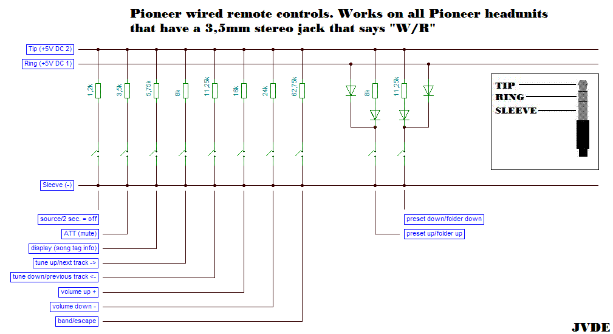
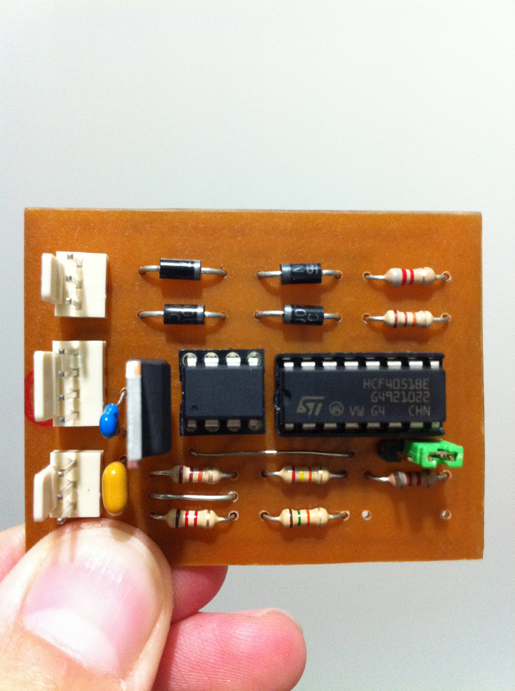
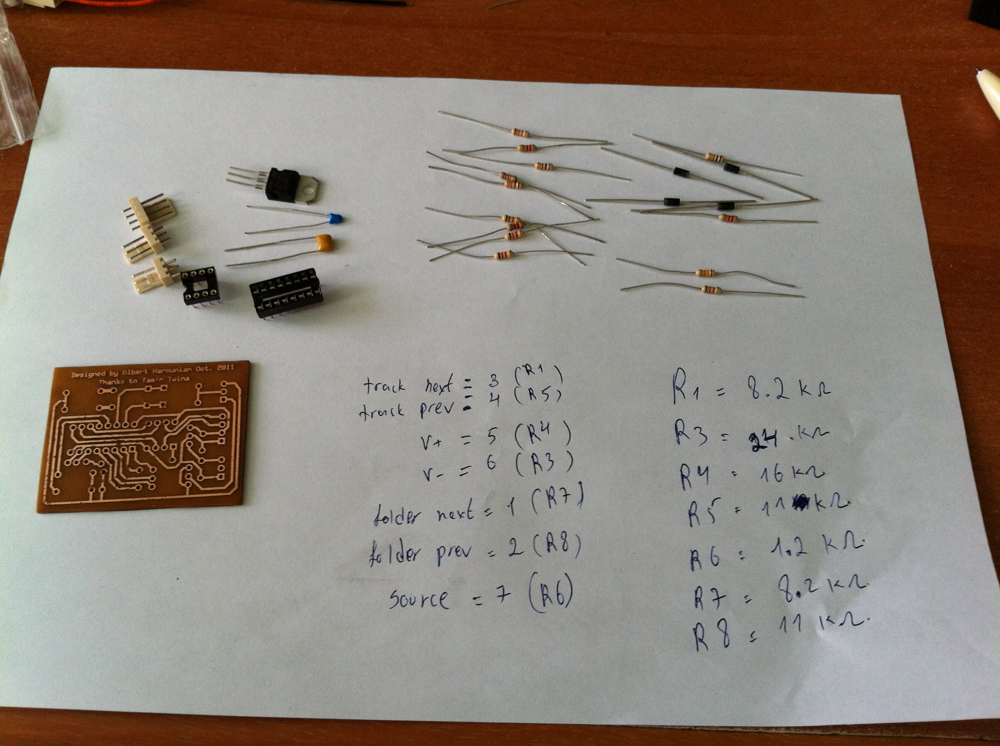

Pioneer IR Remote Control
=========================

About this project
==================
In this project I created a car steering wheel remote control for my car's CD receiver unit. 
I took advantage of the built in wired remote control in the Pioneer DEH-2300UB to add a remote control capability.

The Board
=========

